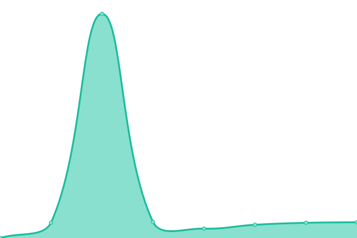

# [📈 Live Status](https://SoBot.github.io/Uptime): <!--live status--> **🟧 Partièlement Down**

This repository contains the open-source uptime monitor and status page for [SoBot](https://SoBot.github.io/Uptime), powered by [Upptime](https://github.com/upptime/upptime).

With [Upptime](https://upptime.js.org), you can get your own unlimited and free uptime monitor and status page, powered entirely by a GitHub repository. We use [Issues](https://github.com/SoBot/Uptime/issues) as incident reports, [Actions](https://github.com/SoBot/Uptime/actions) as uptime monitors, and [Pages](https://SoBot.github.io/Uptime) for the status page.

<!--start: status pages-->
<!-- This summary is generated by Upptime (https://github.com/upptime/upptime) -->
<!-- Do not edit this manually, your changes will be overwritten -->
<!-- prettier-ignore -->
| URL | Statut | Historique | Temps de réponse | Disponibilité |
| --- | ------ | ------- | ------------- | ------ |
|  [SoBot](https://sobot.fr) | 🟩 Up | [so-bot.yml](https://github.com/MattiaPARRINELLO/Uptime/commits/HEAD/history/so-bot.yml) | 

 3637ms
     
 | 

<a href="https://MattiaPARRINELLO.github.io/Uptime/history/so-bot">100.00%</a>
    

|  [Bot Hosting](http://sobot.ddns.net) | 🟥 Down | [bot-hosting.yml](https://github.com/MattiaPARRINELLO/Uptime/commits/HEAD/history/bot-hosting.yml) | 

 0ms
     
 | 

<a href="https://MattiaPARRINELLO.github.io/Uptime/history/bot-hosting">100.00%</a>
    

|  [Discord](https://discord.sobot.fr) | 🟥 Down | [discord.yml](https://github.com/MattiaPARRINELLO/Uptime/commits/HEAD/history/discord.yml) | 

 0ms
     
 | 

<a href="https://MattiaPARRINELLO.github.io/Uptime/history/discord">100.00%</a>
    

|  DataBase 1 | 🟩 Up | [data-base-1.yml](https://github.com/MattiaPARRINELLO/Uptime/commits/HEAD/history/data-base-1.yml) | 

 783ms
     
 | 

<a href="https://MattiaPARRINELLO.github.io/Uptime/history/data-base-1">100.00%</a>
    

|  DataBase 2 | 🟩 Up | [data-base-2.yml](https://github.com/MattiaPARRINELLO/Uptime/commits/HEAD/history/data-base-2.yml) | 

 813ms
     
 | 

<a href="https://MattiaPARRINELLO.github.io/Uptime/history/data-base-2">100.00%</a>
    

|  Control Panel | 🟥 Down | [control-panel.yml](https://github.com/MattiaPARRINELLO/Uptime/commits/HEAD/history/control-panel.yml) | 

 0ms
     
 | 

<a href="https://MattiaPARRINELLO.github.io/Uptime/history/control-panel">100.00%</a>
    

<!--end: status pages-->

[**Visit our status website →**](https://SoBot.github.io/Uptime)

## 📄 License

- Powered by: [Upptime](https://github.com/upptime/upptime)
- Code: [MIT](./LICENSE) © [SoBot](https://SoBot.github.io/Uptime)
- Data in the `./history` directory: [Open Database License](https://opendatacommons.org/licenses/odbl/1-0/)
